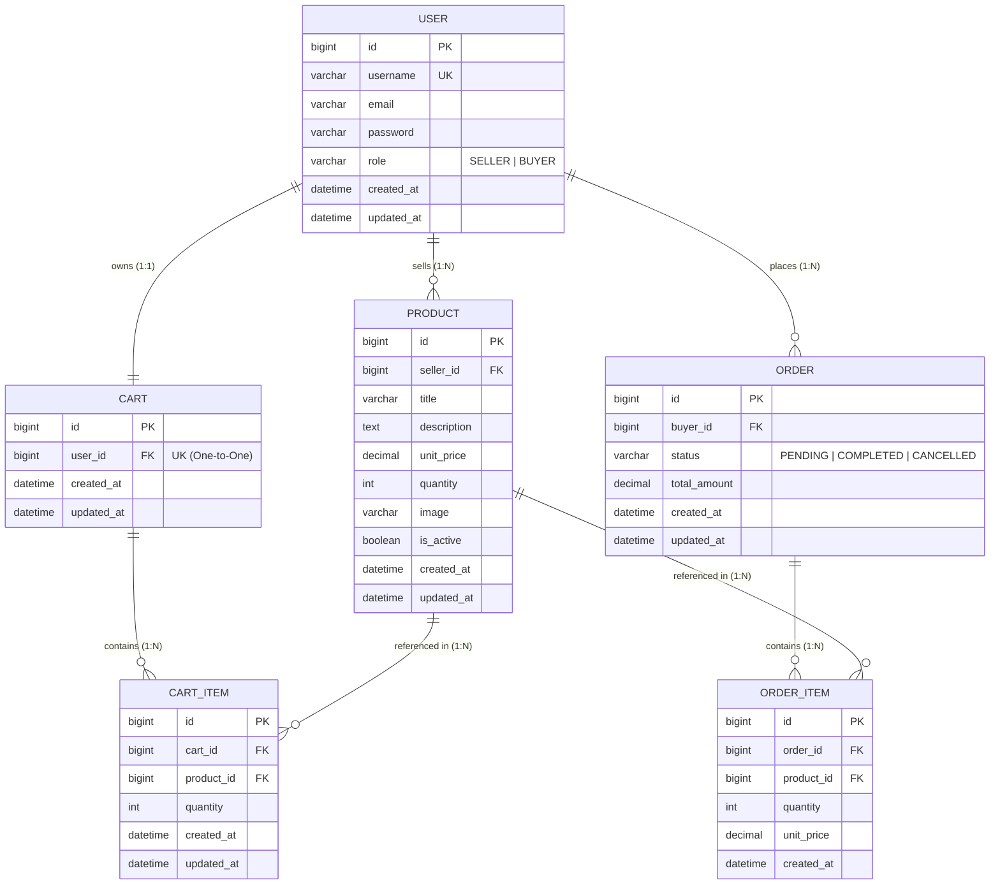

# Entity-Relationship Diagram — StoreFront Management System

## Visual Diagram (Mermaid)

## Relationship Summary

| Relationship | Type | Description |
|---|---|---|
| User → Product | **One-to-Many** | A Seller (`role=SELLER`) owns many product listings via `Product.seller_id` |
| User → Cart | **One-to-One** | Each Buyer has exactly one shopping cart via `Cart.user_id` (unique) |
| User → Order | **One-to-Many** | A Buyer places many orders via `Order.buyer_id` |
| Cart → CartItem | **One-to-Many** | A cart holds multiple line items |
| Product → CartItem | **One-to-Many** | A product can appear in multiple carts (unique per cart) |
| Order → OrderItem | **One-to-Many** | An order contains multiple purchased items |
| Product → OrderItem | **One-to-Many** | A product can appear in many historical orders |

## Key Constraints

- **Primary Keys**: `id` (auto-increment) on all tables
- **Foreign Keys**:
  - `Product.seller_id` → `User.id` (CASCADE on delete)
  - `Cart.user_id` → `User.id` (CASCADE on delete)
  - `CartItem.cart_id` → `Cart.id` (CASCADE on delete)
  - `CartItem.product_id` → `Product.id` (CASCADE on delete)
  - `Order.buyer_id` → `User.id` (CASCADE on delete)
  - `OrderItem.order_id` → `Order.id` (CASCADE on delete)
  - `OrderItem.product_id` → `Product.id` (PROTECT — preserves order history)
- **Unique Constraints**: `(cart_id, product_id)` on `CartItem` — one row per product per cart
- **Check/Validation**: `quantity >= 0` on products; `unit_price > 0`; cart/order item `quantity >= 1`

## Inventory Flow

1. **Mock Purchase** (`POST /api/products/{id}/purchase/`): decrements `Product.quantity` atomically
2. **Checkout** (`POST /api/cart/checkout/`): validates stock for all cart items, creates `Order` + `OrderItem` records (with price snapshot), decrements inventory, clears cart
